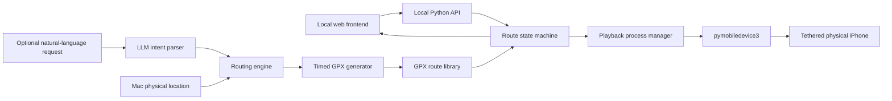
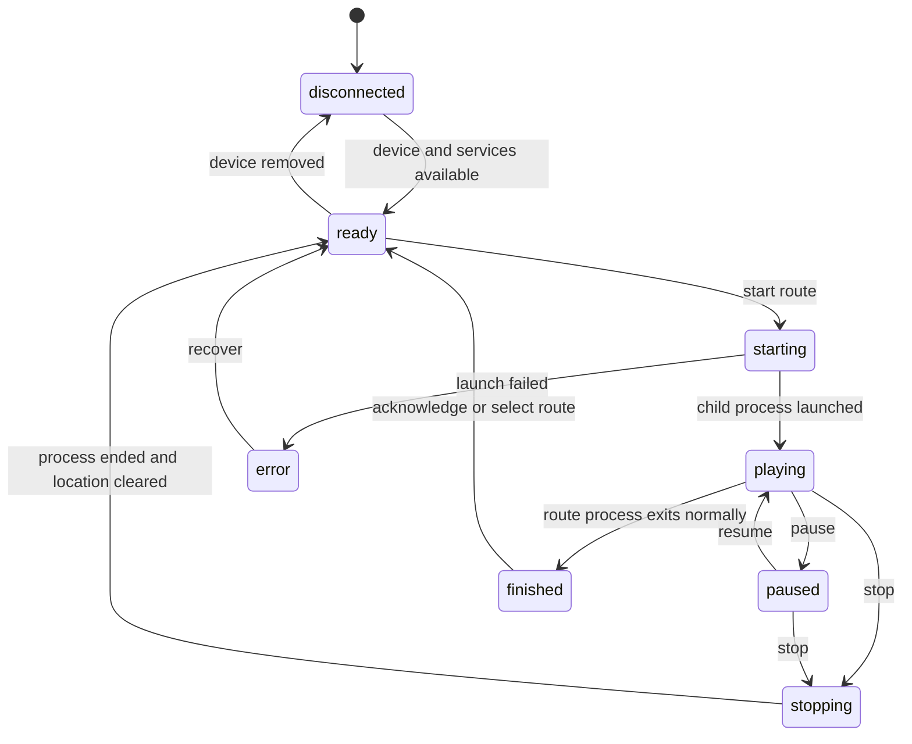

# Tethered iPhone Route Controller

## Engineering handoff for Codex in VS Code

**Status:** Proposed build, with a validated UI prototype and validated source GPX  
**Target host:** macOS  
**Target device:** Physical iPhone connected to the Mac by USB  
**Primary use:** Developer-controlled location simulation for testing and personal demonstrations  
**Last updated:** July 26, 2026

---

## 1. Executive summary

Build a local macOS route-control application that can:

1. Detect a tethered physical iPhone.
2. Show whether location simulation is idle, playing, paused, finished, or in error.
3. Play a saved route from location **L1 to L2**.
4. Play the return route from **L2 to L1**.
5. Show the current simulated position, progress, elapsed time, and remaining time.
6. Pause, resume, stop, and restore the phone's real location.
7. Later, generate new road-following routes from a map, Google Maps directions link, or natural-language request.

The recommended implementation uses:

- A local web frontend based on the existing prototype.
- A small Python backend bound only to `127.0.0.1`.
- [`pymobiledevice3`](https://github.com/doronz88/pymobiledevice3) for communication with the physical iPhone.
- GPX **track points** (`trkpt`) for `pymobiledevice3` playback.
- The original Xcode-compatible GPX **waypoints** (`wpt`) retained as an export/fallback format.

The LLM is optional and belongs in the route-planning layer. It should translate conversational requests into structured route requirements. It must **not invent road geometry or coordinates**. A routing engine such as Google Routes, MapKit, OSRM, or Valhalla should calculate the actual route.

---

## 2. Product goal

The user should be able to connect an iPhone, open one local controller, and press:

- **L1 → L2**
- **L2 → L1**
- **Pause**
- **Resume**
- **Stop & Restore Real Location**

The application should provide enough feedback that the user always knows:

- Which physical device is connected.
- Which route is selected.
- Where the simulated device is along the route.
- Whether the backend process is running.
- Whether the displayed position is simulated or physical.
- How to recover if the connection or route process fails.

---

## 3. Existing artifacts

The original source route is:

```text
/Users/jeewoo/Downloads/route_final.gpx
```

The current deliverable workspace contains:

```text
outputs/
├── route-controller-prototype/
│   ├── index.html
│   ├── styles.css
│   ├── app.js
│   ├── run.sh
│   ├── route_final.gpx
│   ├── route_L1_to_L2.gpx
│   ├── route_L2_to_L1.gpx
│   └── split-gpx.mjs
└── route-controller-prototype.zip
```

The existing frontend prototype includes three throwaway interface variants:

- **A — Mission control**
- **B — Destination first**
- **C — Route timeline**

The prototype currently animates the real route locally but does **not** control the iPhone.

### Known route facts

The source GPX is valid XML and contains:

- **93 total waypoints**
- **L1:** first waypoint at `2026-01-01T12:00:00Z`
- **L2:** midpoint waypoint at `2026-01-01T12:20:00Z`
- **L1 return:** final waypoint at `2026-01-01T12:40:00Z`
- **L1 → L2 source:** 995 points over exactly 20 minutes
- **L2 → L1 source:** 1,070 points over exactly 20 minutes
- **Playback tracks:** interpolated to 0.5-second samples for smoother 20-minute playback
- **Current playback counts:** 2,933 outbound points and 2,441 return points
- The L2 point is included in both directional files.

The original Xcode route uses:

```xml
<wpt lat="37.3835546" lon="-122.1371287">
  <name>L1</name>
  <time>2026-01-01T12:00:00Z</time>
</wpt>
```

---

## 4. Scope

### MVP

- macOS host only.
- One tethered physical iPhone.
- Developer Mode enabled on the phone.
- Device discovery and connection status.
- Two bundled directional routes.
- Start, pause, resume, stop, and clear simulation.
- Current simulated coordinate and route progress.
- Local-only server and frontend.
- Helpful error messages and recovery actions.

### Phase-two route creation

- Paste a Google Maps directions link.
- Enter origin and destination manually.
- Use the Mac's physical location as a destination.
- Preview a road-following route.
- Choose travel mode and total duration.
- Generate both Xcode and `pymobiledevice3` GPX formats.

### Optional LLM phase

- Natural-language route requests.
- Structured intent extraction.
- Saved place names such as L1, L2, Home, and Physical Location.
- Multi-stop routes and requested waiting times.

### Non-goals for the first implementation

- App Store distribution.
- Remote access from other computers.
- Multiple phones simultaneously.
- User accounts or cloud persistence.
- A general-purpose navigation application.
- Having the LLM calculate or fabricate route coordinates.
- Automating the Maps to GPX website.
- Supporting jailbroken-device tooling.

---

## 5. Recommended architecture



### Why a Python backend

`pymobiledevice3` is both a Python package and a command-line application. A Python backend provides:

- Direct access to the same ecosystem.
- Easy subprocess management if the CLI is used first.
- Straightforward XML/GPX transformation.
- Simple local HTTP and WebSocket/SSE APIs.
- A clear path from a CLI proof of concept to direct library integration.

### Why retain the local web frontend

- A functioning UI prototype already exists.
- It is easy to iterate in VS Code.
- It avoids committing to AppKit/SwiftUI before the device backend is proven.
- It can later be packaged as a macOS app with a wrapper if desired.

### Alternative native architecture

A SwiftUI macOS app could call the `pymobiledevice3` executable as a child process. This would provide native Keychain and Core Location integration, but increases early complexity. Prove the device and route lifecycle in Python first.

---

## 6. Critical GPX compatibility requirement

Xcode and `pymobiledevice3` do not consume the current source in exactly the same way.

### Xcode-compatible export

Retain the existing waypoint form:

```xml
<gpx version="1.1" creator="Route Controller">
  <wpt lat="..." lon="...">
    <time>...</time>
  </wpt>
</gpx>
```

### `pymobiledevice3` playback export

Generate a track:

```xml
<?xml version="1.0" encoding="UTF-8"?>
<gpx version="1.1" creator="Route Controller">
  <trk>
    <name>L1 to L2</name>
    <trkseg>
      <trkpt lat="37.3835546" lon="-122.1371287">
        <time>2026-01-01T12:00:00Z</time>
      </trkpt>
      <!-- additional track points -->
    </trkseg>
  </trk>
</gpx>
```

The current [`pymobiledevice3` GPX playback implementation](https://github.com/doronz88/pymobiledevice3/blob/master/pymobiledevice3/services/dvt/instruments/location_simulation_base.py) parses `gpx.tracks`, then iterates each track's segments and points. It waits for the timestamp difference between consecutive points and sends each coordinate to the device. A file containing only `wpt` elements will parse but will not supply track points to this playback loop.

### Conversion rules

1. Preserve every latitude and longitude.
2. Preserve chronological order.
3. Preserve timestamp differences.
4. Convert `wpt` to `trkpt`.
5. Wrap all directional points in one `trk` and one `trkseg`.
6. Keep the route name in the `trk/name` element.
7. Validate generated XML.
8. Validate timestamps are monotonic.
9. Confirm each directional duration is exactly 1,200 seconds.
10. Interpolate playback tracks to half-second samples for smooth device movement.

### Generated-route timing

For a route without timestamps:

1. Sample distance-spaced anchors from the route polyline.
2. Obtain road-leg durations from the configured routing provider.
3. Map the provider durations back onto the original geometry.
4. Scale the relative speed profile when a custom duration was requested.
5. Fall back to cumulative-distance timing only when a custom duration exists.
6. Interpolate the resulting profile into half-second playback points.
7. Use UTC ISO 8601 timestamps.

Do not ask an LLM to assign coordinates or timing.

---

## 7. Physical-device connection model

### Prerequisites

- A recent Python version supported by `pymobiledevice3`.
- `pymobiledevice3` installed in an isolated virtual environment.
- iPhone connected and trusted.
- iPhone unlocked during initial connection.
- Developer Mode enabled.
- Developer disk image or personalized image mounted if required.

### Initial discovery commands

```bash
pymobiledevice3 usbmux list
pymobiledevice3 mounter auto-mount
```

### iOS 17 and later

Apple moved developer-service access to CoreDevice/RemoteXPC starting with iOS 17. Current `pymobiledevice3` normally handles the required RSD connection itself. Its [current iOS 17+ tunnel guide](https://github.com/doronz88/pymobiledevice3/blob/master/docs/guides/ios17-tunnels.md) documents this split:

- **iOS 17.4+:** The ordinary developer command automatically creates an in-process userspace tunnel over USB on macOS without root/admin privileges. The tunnel is created for that command and removed when it exits.
- **iOS 17.0–17.3.1:** These versions predate the CoreDeviceProxy service. The project routes them to a privileged `tunneld` by default.
- A privileged tunnel may also be useful for a shared/persistent connection or an external tool that must reach the tunneled device directly.

For iOS 17.0–17.3.1, the current documented daemon command is:

```bash
sudo python3 -m pymobiledevice3 remote tunneld
```

Manual tunnel creation also exists, including the following for iOS 17.4+, but it is not the default prerequisite:

```bash
sudo python3 -m pymobiledevice3 lockdown start-tunnel
```

The application should:

1. First try the ordinary developer command and allow `pymobiledevice3` to establish its automatic userspace tunnel.
2. Detect the iOS version and tunnel-related failures.
3. Request a privileged tunnel only when the device version or failure actually requires it.
4. Never silently request, collect, or store administrator credentials.

### Playback commands

The intended CLI flow, documented in the upstream [`pymobiledevice3` CLI recipes](https://github.com/doronz88/pymobiledevice3/blob/master/docs/guides/cli-recipes.md#dvt-examples), is:

```bash
pymobiledevice3 developer dvt simulate-location play route_L1_to_L2.track.gpx
```

```bash
pymobiledevice3 developer dvt simulate-location play route_L2_to_L1.track.gpx
```

```bash
pymobiledevice3 developer dvt simulate-location clear
```

The installed version's `--help` output is authoritative. Capture it during the backend proof-of-concept because flags and service-provider arguments may vary by version and iOS generation.

---

## 8. Route playback process management

Start with the CLI as a child process rather than directly importing private or unstable implementation details.

### Required process behavior

- Launch exactly one route playback process.
- Capture standard output and standard error.
- Record its PID.
- Refuse to launch a second route until the first is stopped or completed.
- On normal completion, mark the route `finished`.
- On nonzero exit, show the relevant error and mark the route `error`.
- On application shutdown, stop active playback and offer to clear simulated location.
- Never execute arbitrary user-provided shell text.
- Pass arguments as an array; do not construct a shell command string.

### Pause and resume

The route player's waits happen in its running process. For a macOS-only MVP:

- Pause may send `SIGSTOP` to the owned playback process.
- Resume may send `SIGCONT`.
- The last simulated coordinate should remain active while the process is stopped.

This behavior must be tested on the real device. If it proves unreliable:

1. Terminate playback.
2. Record the current route point.
3. Generate a temporary GPX track beginning at that point.
4. Resume by playing the remainder.

### Stop

Stop should:

1. Terminate only the child process owned by this application.
2. Wait briefly for clean termination.
3. Escalate to a forced process kill only if necessary.
4. Run `simulate-location clear`.
5. Reset controller state to `idle`.

Do not kill processes by broad name matching.

---

## 9. State model



### State payload

```json
{
  "connection": "connected",
  "device": {
    "name": "iPhone",
    "udid": "redacted-or-local-only",
    "iosVersion": "unknown-until-detected"
  },
  "playback": {
    "state": "playing",
    "routeId": "l1-to-l2",
    "startedAt": "2026-07-26T00:00:00Z",
    "elapsedSeconds": 312,
    "durationSeconds": 1200,
    "progress": 0.26,
    "currentCoordinate": {
      "latitude": 37.0,
      "longitude": -122.0
    }
  },
  "lastError": null
}
```

The frontend's progress should be derived from route timestamps and the monotonic host clock. It is an estimate of the playback process, not a GPS reading returned by the iPhone.

---

## 10. Suggested local API

Bind to `127.0.0.1`, not `0.0.0.0`.

### Read operations

```text
GET /api/status
GET /api/devices
GET /api/routes
GET /api/routes/{routeId}
GET /api/routes/imports
GET /api/routes/imports/{filename}
```

### Control operations

```text
POST /api/routes/{routeId}/start
POST /api/playback/pause
POST /api/playback/resume
POST /api/playback/stop
POST /api/location/set
POST /api/location/clear
```

`POST /api/location/set` accepts numeric `latitude` and `longitude` fields,
rejects out-of-range coordinates and active route playback, then activates the
static coordinate on the connected iPhone. The controller retains that static
position in its runtime status until route playback begins or location is
cleared. The Coordinates panel can also enter a one-click Cesium selection
mode. The selected point remains a frontend draft and map marker until the user
explicitly presses **Activate**.

### Route creation

```text
POST /api/routes/import-gpx
POST /api/routes/imports/{filename}/prepare
DELETE /api/routes/imports/{filename}
POST /api/routes/from-google-maps-link
POST /api/routes/from-directions
POST /api/routes/from-prompt
```

`POST /api/routes/import-gpx` is implemented as a JSON-first endpoint. Its
request body contains `filename` and `content` strings. It accepts a single GPX
track, route, or waypoint collection, with or without timestamps, and saves the
validated source under `routes/imports/`. The response returns geometry
metadata for the frontend preview. The Phase 3C frontend reads the same local
file, uploads it to this endpoint, lists saved imports in the Import GPX
accordion, and renders the selected geometry in Cesium. The import-list and
detail endpoints rebuild their metadata from files in `routes/imports/`, so
the list survives page refreshes without browser storage. Imported routes
remain preview-only until the user explicitly prepares a timed playback track.

Phase 3D implements `POST /api/routes/imports/{filename}/prepare`. The request
accepts an optional playback duration in seconds, a timing mode, and an optional
label. Fully timed sources retain their relative timing profile while being
scaled when a custom duration is selected. The result is normalized into one
`trk/trkseg`, resampled at fixed half-second intervals with a final partial
interval when needed, saved under
`routes/generated/`, and upserted into the route registry as a custom route.
The frontend enables phone playback only after this preparation succeeds.

Phase 3E replaces uniform timing as the default for untimed imports. The timing
module presents one interface that returns a complete monotonic timing plan.
Its production OSRM adapter samples at most 90 distance-spaced anchors from the
GPX, requests driving duration for every resulting road leg, and maps those leg
durations back onto the original geometry. This retains the imported path while
allowing highways, ramps, and surface streets to receive different relative
speeds. A requested custom duration scales the full profile rather than
flattening it. The import panel discloses that those sampled coordinates leave
the Mac for the configured OSRM endpoint.

Timing modes returned in route metadata:

- `source`: every GPX point had a valid timestamp, so relative source timing was
  preserved.
- `route-aware`: OSRM supplied the road-leg duration profile.
- `uniform`: cumulative-distance timing was used as an explicit or offline
  fallback.

The frontend's **Use Best Available Travel Time** option leaves duration
selection to the source timestamps or provider ETA. If the import is untimed
and the provider is unavailable, best-available preparation fails with an
actionable message instead of silently inventing an ETA. The user can uncheck
the option, provide a custom duration, and prepare with a clearly labeled
uniform fallback.

`DELETE /api/routes/imports/{filename}` removes the exact validated import,
any generated playback track registered from that source, and the matching
custom route-registry entry. It refuses deletion while the matching route is
active. The frontend requires an explicit irreversible-delete confirmation and
uses backend capability metadata to distinguish a stale pre-3E process from a
route-preparation error.

Phase 3F implements `POST /api/routes/from-directions`. The request accepts a
validated numeric origin and destination, endpoint labels, a route name, and
the `driving` profile. The OSRM directions adapter requests full GeoJSON road
geometry plus edge-duration annotations. The backend validates the provider
response, writes a timed source GPX under `routes/imports/`, and returns a
Cesium-ready preview with distance and provider ETA. It does not register a
playable route: the user must review the preview and use the existing Prepare
action before phone playback is enabled.

The frontend Route Builder can fill either endpoint from the current simulated
position, browser-provided Mac physical location, manual decimal coordinates,
or a Cesium map click. Simulated and physical positions remain explicitly
named. Selected coordinates are sent only to the configured OSRM endpoint and
are not written to application logs. Generated source GPX files retain
endpoint names and relative provider timing, so custom preparation durations
scale the road-speed profile instead of flattening it.

Phase 3G implements `POST /api/routes/from-google-maps-link`. It accepts a full
coordinate-based Google Maps directions URL or a Google-owned short link.
Short-link expansion follows at most five redirects, permits only Google-owned
hosts, and never fetches arbitrary submitted hosts. The parser accepts the
official `api=1&origin=<lat,lon>&destination=<lat,lon>` form and coordinate
endpoint paths used by shared directions links.

The link provides semantic endpoints, not trusted route geometry. Central Blue
passes the extracted coordinates through the existing OSRM directions module,
saves the timed GPX preview, and requires the same explicit Prepare step before
phone playback. Links containing only place names or addresses return a clear
`google_maps_geocoding_required` error because named-place resolution belongs
to Phase 4.

Generated-route metadata is stored in a local JSON sidecar beside each imported
GPX. Provider, distance, ETA, source type, endpoint labels, and exact requested
coordinates therefore survive page refreshes. Deleting an import also deletes
its sidecar.

### Live updates

Use Server-Sent Events or WebSockets:

```text
GET /api/events
```

Events:

- `device.connected`
- `device.disconnected`
- `playback.started`
- `playback.progress`
- `playback.paused`
- `playback.resumed`
- `playback.finished`
- `playback.stopped`
- `playback.error`

---

## 11. Frontend requirements

### Primary controls

- Device selector/status.
- L1 → L2 button.
- L2 → L1 button.
- Pause/resume button.
- Stop & restore button.
- Progress bar.
- Elapsed and remaining time.
- Current simulated coordinate.
- Map route and moving marker.

### Required labels

Always distinguish:

- **Simulated location**
- **Mac physical location**
- **Route destination**

Never label the simulated coordinate simply as “Current location” once physical-location support is added.

### Error states

Provide specific messages for:

- No phone connected.
- Phone locked.
- Device not trusted.
- Developer Mode disabled.
- Developer image not mounted.
- Tunnel unavailable.
- Route file invalid.
- No track points.
- Non-monotonic timestamps.
- Playback process failed.
- Device disconnected during playback.
- Location-clear command failed.

Each error should include one recovery action.

---

## 12. Dynamic route generation

### Google Maps link workflow

[Maps to GPX](https://mapstogpx.com/) demonstrates a useful interaction:

1. Build directions in Google Maps.
2. Copy the directions share link.
3. Paste it into a converter.
4. Produce a route or track GPX.

Our application should reproduce the workflow without automating or scraping the Maps to GPX website. Its [mobile-development page](https://mapstogpx.com/mobiledev.php) explicitly reports automated-traffic costs and does not document a public automation API.

Implemented Phase 3 flow:

1. Accept a full or shortened Google Maps directions URL.
2. Expand Google-owned shortened links with a redirect host allowlist.
3. Parse coordinate origin and destination.
4. Send those semantic inputs to the configured OSRM routing provider.
5. Obtain a road-following polyline.
6. Preview the route.
7. Save the timed source GPX and prepare a half-second `pymobiledevice3` track
   only after explicit review.

Do not assume a shared Google Maps URL contains the complete detailed route geometry.
Named-place geocoding, intermediate stops, and natural-language endpoint
resolution remain Phase 4 work.

### Routing-engine choices

#### Google Routes

- Most likely to reproduce a Google Maps-style route.
- Requires an API key and billing configuration.
- Review current Google Maps Platform storage, display, attribution, and usage terms before implementation.
- Never embed an unrestricted server key in frontend JavaScript.

#### MapKit

- Natural choice for a future native macOS app.
- Integrates with Core Location and Apple maps.
- Route may differ from Google Maps.

#### OSRM or Valhalla

- Open routing engines.
- Can be self-hosted or accessed through a provider.
- Public demonstration endpoints should not be treated as a production dependency.

---

## 13. Physical location

When simulated location is active, the iPhone's Core Location result represents the simulated coordinate. It cannot also serve as a trusted source for its physical position.

Preferred sources:

1. The Mac's Location Services, because the phone is tethered to the Mac.
2. A physical position captured before simulation begins.
3. Manual map selection.
4. A named or typed destination.
5. Temporarily clear simulation, obtain a real position, then restore the prior simulated point.

For the local web MVP, manual selection or a directions link is simplest. A native macOS version can use `CLLocationManager` with explicit permission.

---

## 14. Optional LLM integration

### Appropriate LLM responsibility

Translate:

> “Take me from the current simulated location to where my Mac physically is, avoid highways, and make it take roughly 30 minutes.”

Into:

```json
{
  "origin": {
    "kind": "current_simulated_location"
  },
  "destination": {
    "kind": "mac_physical_location"
  },
  "travelMode": "driving",
  "avoid": ["highways"],
  "requestedDurationMinutes": 30,
  "stops": []
}
```

### Inappropriate LLM responsibility

The model must not:

- Invent the route polyline.
- Fabricate latitude/longitude sequences.
- Claim that a route follows roads without routing-engine confirmation.
- Start device playback without showing the resolved route and receiving user confirmation.
- Receive precise location unless the user has knowingly enabled that feature.

### Privacy and key management

- Keep cloud-model API keys out of frontend code.
- Store secrets in the macOS Keychain or a backend-only environment.
- Ask before sending precise coordinates to a cloud model.
- Prefer sending place labels or coarse context when exact coordinates are unnecessary.
- Allow a fully non-LLM workflow.

---

## 15. Security and safety requirements

- Bind the backend only to loopback.
- Do not expose a route-control port to the LAN.
- Apply strict CORS rules.
- Do not accept arbitrary executable paths or shell commands.
- Validate uploaded GPX size and XML structure.
- Allow route files only from an application-controlled directory.
- Redact device identifiers from normal logs.
- Do not log precise physical coordinates by default.
- Keep an obvious Stop & Restore control visible during playback.
- On abnormal exit, tell the user how to clear simulated location.
- Use the tool only where location simulation is permitted; third-party applications may prohibit it.

---

## 16. Proposed project layout

```text
iphone-route-controller/
├── README.md
├── pyproject.toml
├── .env.example
├── backend/
│   ├── app.py
│   ├── api/
│   │   ├── status.py
│   │   ├── devices.py
│   │   ├── playback.py
│   │   └── routes.py
│   ├── services/
│   │   ├── device_service.py
│   │   ├── playback_service.py
│   │   ├── tunnel_service.py
│   │   ├── gpx_service.py
│   │   └── routing_service.py
│   ├── models/
│   │   ├── device.py
│   │   ├── playback.py
│   │   └── route.py
│   └── tests/
├── frontend/
│   ├── index.html
│   ├── styles.css
│   ├── app.js
│   └── assets/
├── routes/
│   ├── source/
│   │   └── route_final.gpx
│   ├── xcode/
│   │   ├── route_L1_to_L2.gpx
│   │   └── route_L2_to_L1.gpx
│   └── tracks/
│       ├── route_L1_to_L2.track.gpx
│       └── route_L2_to_L1.track.gpx
└── scripts/
    ├── verify_environment.py
    └── convert_waypoints_to_track.py
```

Keep the initial implementation small. The service separation above is a target shape, not a requirement to create empty abstractions before the CLI proof works.

---

## 17. Implementation phases

### Phase 0 — environment proof

Goal: Prove the Mac can control a location on this exact phone.

Tasks:

1. Record macOS, Xcode, iPhone, and iOS versions.
2. Install `pymobiledevice3` in an isolated environment.
3. Run device discovery.
4. Mount the required developer image.
5. Let `pymobiledevice3` attempt its automatic no-root userspace tunnel.
6. Establish a privileged tunnel only if the detected iOS version or connection error requires it.
7. Set one static test coordinate.
8. Clear it and confirm real location returns.

Exit criterion: Static set and clear both succeed on the target phone.

### Phase 1 — GPX route proof

1. Write waypoint-to-track conversion.
2. Generate the two directional track files.
3. Validate XML, point count, order, and duration.
4. Play L1 → L2 from Terminal.
5. Play L2 → L1 from Terminal.
6. Verify route timing and stop behavior.

Exit criterion: Both 20-minute routes play correctly from the CLI.

### Phase 2 — functional local controller

1. Create local backend.
2. Implement device status.
3. Implement playback process ownership.
4. Connect existing frontend controls.
5. Add progress updates.
6. Add pause/resume and stop/clear.
7. Add actionable error messages.

Exit criterion: No terminal interaction is needed after prerequisites are running.

### Phase 3 — route import and generation

1. Import arbitrary GPX. **Implemented**
2. Show a map preview. **Implemented**
3. Validate and convert formats. **Implemented**
4. Add route-aware timing for imported GPX. **Implemented**
5. Accept origin/destination. **Implemented**
6. Generate road-following geometry through the routing provider. **Implemented**
7. Add Google Maps directions-link parsing. **Implemented**

Exit criterion: A user can create, preview, save, and play a new route.

### Phase 4 — LLM route assistant

1. Define a strict structured request schema.
2. Add natural-language input.
3. Resolve named locations.
4. Call the routing provider.
5. Require preview confirmation.
6. Add privacy settings.

Exit criterion: Natural-language requests reliably become confirmed, road-following routes.

---

## 18. Testing strategy

### Unit tests

- GPX waypoint parsing.
- Waypoint-to-track conversion.
- Timestamp monotonicity.
- Directional splitting at L2.
- Point counts.
- Duration calculation.
- Coordinate interpolation.
- Route-state transitions.
- Child-process argument construction.
- Google Maps URL input validation.
- LLM structured-output validation.

### Integration tests without a phone

- Use a fake playback executable that logs arguments and progress.
- Simulate normal exit, nonzero exit, hang, pause, resume, and termination.
- Verify the backend never launches two players.
- Verify stop only terminates the owned process.
- Verify malformed GPX never reaches the playback layer.

### Physical-device acceptance tests

- Phone detected while unlocked.
- Helpful state while locked.
- Static set and clear.
- Complete L1 → L2.
- Complete L2 → L1.
- Pause for at least 30 seconds, then resume.
- Stop midway and restore real GPS.
- Disconnect cable during playback.
- Reconnect and recover.
- Quit the controller during playback.
- Restart and clear a lingering simulated location.

---

## 19. MVP acceptance criteria

The MVP is complete when:

- The intended physical iPhone is shown in the UI.
- Each direction starts from one clearly labeled button.
- L1 → L2 source contains 995 points and lasts 20 minutes.
- L2 → L1 source contains 1,070 points and lasts 20 minutes.
- Playback GPX files contain half-second interpolated samples and last 20 minutes.
- Starting a route updates the physical phone's simulated position.
- Progress follows the GPX timestamps.
- Pause and resume work without jumping to an incorrect point.
- Stop ends playback and restores real location.
- A second route cannot start while one is active.
- Device or tunnel errors are understandable without reading backend logs.
- The backend is reachable only from the local Mac.
- No API key or precise physical location appears in committed source or routine logs.

---

## 20. Open decisions

Resolve these after Phase 1, not before:

1. Which prototype layout becomes the production UI: A, B, C, or a combination?
2. What iOS version is on the target phone?
3. Does the current `pymobiledevice3` build automatically discover a suitable tunnel, or must the application retain explicit RSD connection details?
4. Does `SIGSTOP`/`SIGCONT` provide acceptable pause/resume behavior on the target Mac?
5. Should the first route generator use Google Routes, MapKit, or an open routing engine?
6. Is matching Google Maps routing more important than avoiding API keys and billing?
7. Should physical location come from the Mac, manual map selection, or both?
8. Should the finished product remain a local web app or become a packaged SwiftUI macOS app?
9. Should LLM support be local-only, cloud-based, or optional between both?

---

## 21. Recommended first Codex task

Do not begin by redesigning the frontend. First prove device control and GPX compatibility.

Paste the following into Codex in VS Code:

> We are building the tethered physical-iPhone route controller described in `iphone-route-controller-build-spec.md`. Start with Phase 0 and Phase 1 only. Inspect the supplied GPX and existing prototype before editing. Create a minimal Python project with:
>
> 1. An environment verification command that reports whether `pymobiledevice3` is installed and whether a physical iPhone is discoverable.
> 2. A tested converter from Xcode `wpt` GPX files to `pymobiledevice3` `trk/trkseg/trkpt` GPX files, preserving coordinates and timestamp differences.
> 3. Generated L1→L2 and L2→L1 track files.
> 4. A small CLI wrapper that starts one selected route and clears simulation safely.
> 5. Unit tests for point counts, names, ordering, monotonic timestamps, and 1,200-second duration.
>
> Do not add LLM integration, routing APIs, a database, or a new frontend yet. Do not run privileged tunnel commands without asking. Use subprocess argument arrays rather than shell command strings. Show the exact physical-device setup commands separately and stop for confirmation before running anything that needs administrator privileges.

---

## 22. Primary sources

### `pymobiledevice3`

- Repository: <https://github.com/doronz88/pymobiledevice3>
- CLI recipes, including location set/play/clear:  
  <https://github.com/doronz88/pymobiledevice3/blob/master/docs/guides/cli-recipes.md>
- Current GPX playback implementation:  
  <https://github.com/doronz88/pymobiledevice3/blob/master/pymobiledevice3/services/dvt/instruments/location_simulation_base.py>
- iOS 17+ tunnel documentation:  
  <https://github.com/doronz88/pymobiledevice3/blob/master/docs/guides/ios17-tunnels.md>

### Apple

- Simulating location in tests:  
  <https://developer.apple.com/documentation/xcode/simulating-location-in-tests>
- Running apps on simulated or physical devices:  
  <https://developer.apple.com/documentation/xcode/running-your-app-on-simulated-or-physical-devices>
- Xcode command-line tool reference:  
  <https://developer.apple.com/documentation/xcode/xcode-command-line-tool-reference>

### Related open-source projects

- GeoPort: <https://github.com/davesc63/GeoPort>
- LocationSimulator: <https://github.com/Schlaubischlump/LocationSimulator>
- iFakeLocation: <https://github.com/master131/iFakeLocation>

### Route-conversion reference

- Maps to GPX: <https://mapstogpx.com/>
- Maps to GPX mobile-development converter: <https://mapstogpx.com/mobiledev.php>

---

## 23. Final implementation principle

Keep three responsibilities separate:

1. **Intent:** what journey the user wants.
2. **Routing:** the authoritative road-following geometry and timing.
3. **Playback:** sending validated track points to the tethered iPhone.

The frontend and optional LLM handle intent. A routing engine handles geography. `pymobiledevice3` handles physical-device playback. This separation keeps the system understandable, testable, and replaceable when Apple or a routing provider changes an API.
